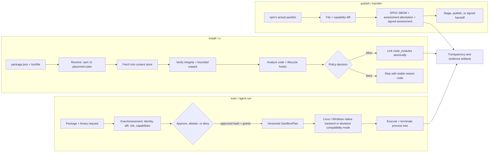

# Oath

[](https://github.com/Generalized-Labs/oath/actions/workflows/ci.yml)
[](https://github.com/Generalized-Labs/oath/releases/latest)
[](https://github.com/Generalized-Labs/oath/stargazers)
[](LICENSE)
[](https://generalized-labs.github.io/oath/)

Oath is a security-first JavaScript package workflow and assessed `npx`
alternative. It resolves packages with npm 11 placement semantics, verifies
their bytes, analyzes code and lifecycle behavior, applies an explicit policy,
and records what happened. When native containment is requested, Oath reports
the enforcement backend and fails closed if the required boundary is missing.

Oath does **not** claim that a scanner score proves safety, that every npm
workflow is already covered, or that it is faster than npm or Bun. See the
[published evidence](https://generalized-labs.github.io/oath/) and
[GA evidence contract](docs/GA_EVIDENCE.md) for the measured boundary.

## Five-minute start

### 1. Install the stable release on macOS or Linux

```sh
curl -fsSL https://raw.githubusercontent.com/Generalized-Labs/oath/master/install.sh | sh
export PATH="$HOME/.local/bin:$PATH"
oath --version
```

The installer selects the correct macOS/Linux asset, downloads its `.sha256`
sidecar, verifies the binary, and fails closed when the checksum is missing or
wrong.

### 2. Create and verify a small project

```sh
mkdir oath-demo && cd oath-demo
oath init oath-demo
oath add picocolors@1.1.1
oath verify
```

`oath verify` should finish with `lockfile: clean`.

### 3. Inspect a package without executing it

```sh
oath exec --dry-run --json prettier@3.7.4
```

The result is machine-readable and includes the resolved identity, integrity,
inferred permissions, findings, policy decision, and effective sandbox mode.
`--dry-run` does not start package code.

`ExecAssessment v3` is the default JSON contract and includes policy/evidence
digests, expiry, rule-bundle identity, limitations, and an Ed25519 signature.
Existing integrations can request the previous shape with
`--schema-version 2` for one major release.
The schemas, TypeScript types, and cross-language `oath-json-v1` verification
procedure live in [`contracts/`](contracts/README.md).

`oath publish --dry-run --json` similarly emits a signed
`PublishAssessment v2`; use `--schema-version 1` during the compatibility
window. JSON modes reserve stdout for one parseable document.

> [!IMPORTANT]
> The installer follows the latest non-prerelease GitHub release. The `v0.2.4`
> line is a developer preview that adds staged publishing, signed transfers,
> the PostgreSQL registry control plane, portable deployment, signed agent
> contracts, expanded evidence, native capability reporting, and Windows assets.
> Preview users can download its release
> assets or build `master` from source; `v0.1.7` remains the stable binary. The
> signed `v0.2.0` tag did not publish a GitHub release after its Linux artifact
> builds failed, and it remains immutable as part of the release record.

## Release status

`v0.2.4` is a developer preview, not a general-availability
claim. The tested CLI workflow slices and native Linux/Windows boundaries have
public evidence. The hosted registry remains a business-beta control plane, and
the broader GA gates for detection quality, performance, signed platform
binaries, service reliability, independent review, and design-partner adoption
are not all complete. The exact go/no-go contract is in
[the release-complete plan](docs/RELEASE_COMPLETE_PLAN.md).

## How Oath works



The same package identity, integrity hash, assessment, policy decision, granted
capabilities, backend, and result flow into the evidence record. An approval is
bound to those values—not merely to a package name—so a new tarball hash requires
a new decision.

## Evidence snapshot

| Evidence class | Current result | What it means |
| --- | ---: | --- |
| Generated stress executions | 10,000 / 10,000 | Deterministic comparisons, 2,000 each across clean, warm, offline, repeat, and interrupted modes; **not** 10,000 independent npm behaviors |
| Pinned real-project trees | 250 / 250 | Exact npm/Oath dependency-tree equivalents for the eligible locked corpus |
| Independently reviewed workflows | 300 / 300 platform results | 100 workflow IDs matched npm 11.12.1 on Linux, macOS, and Windows |
| Native capability reports | 4 / 4 | Ubuntu 24 strict enforcement, Ubuntu 22 fail-closed behavior, and Windows Server 2022/2025 containment |

These results come from exact-master CI run
[29403483148](https://github.com/Generalized-Labs/oath/actions/runs/29403483148)
at commit `49f98e650ae3b5066463e585a8843189eb00ccfc`; all 60 jobs and the
`release-evidence-gate` passed. A release tag still requires the same full gate
to pass on the exact tagged commit.

The post-merge smoke set also matched 108,376 installed entries across Rspack,
Karma, and Mattermost. The current installer benchmark does **not** support a
speed claim: Oath was slower than npm and Bun on both cold and warm runs.

- [Live evidence website](https://generalized-labs.github.io/oath/)
- [Compatibility and security methodology](docs/GA_EVIDENCE.md)
- [v0.2.4 release-readiness report](docs/RELEASE_READINESS.md)
- [npm workflow contract](docs/NPM_COMPATIBILITY_CONTRACT.md)
- [Scanner threat model and limitations](docs/scanner-threat-model.md)
- [Registry deployment and operations](docs/REGISTRY_OPERATIONS.md)
- [Cloud-neutral container and Kubernetes deployment](deploy/kubernetes/README.md)
- [Supported platform and compatibility matrix](docs/SUPPORTED_PLATFORMS.md)
- [Published JSON Schemas and TypeScript contracts](contracts/)
- [Registry OpenAPI contract](contracts/registry-openapi.yaml)
- [Service objectives](docs/SERVICE_LEVEL_OBJECTIVES.md)
- [Incident response](docs/INCIDENT_RESPONSE.md)
- [Data retention and deletion](docs/DATA_RETENTION.md)
- [Package lifecycle and revocation policy](docs/PACKAGE_LIFECYCLE_POLICY.md)
- [Legal and compliance gate tracker](docs/LEGAL_READINESS.md)
- [GA gate tracker](docs/GA_GATE_TRACKER.md)
- [Support policy](SUPPORT.md)
- [Raw installer benchmark](compat-results/benchmarks/installers.json)

## Installation options

### Stable binary: macOS and Linux

Use the checksum-verifying installer shown in the quick start. To choose another
installation directory:

```sh
curl -fsSL https://raw.githubusercontent.com/Generalized-Labs/oath/master/install.sh | OATH_INSTALL="$HOME/bin" sh
```

The checked-in formula targets `v0.1.7`; the separately published tap may update
on a different schedule. Check its version before using it:

```sh
brew info generalized-labs/tap/oath
```

### Current source: macOS and Linux

Rust 1.94 or newer is required. On Ubuntu/Debian, install the Linux sandbox
linker dependency first:

```sh
sudo apt-get update
sudo apt-get install -y build-essential pkg-config libseccomp-dev
git clone https://github.com/Generalized-Labs/oath.git
cd oath
cargo build --release --locked --bin oath
./target/release/oath --version
```

On macOS, the same source steps work without `apt-get`.

### Current source: Windows

Install Rust with the MSVC toolchain and run in PowerShell:

```powershell
git clone https://github.com/Generalized-Labs/oath.git
cd oath
cargo build --release --locked --bin oath
.\target\release\oath.exe --version
```

Windows Server 2022 and 2025 native-containment checks pass in CI. The `v0.2.4`
developer-preview release includes x86-64 and ARM64 Windows binaries. Do not use
the Unix installer on Windows.

## Core commands

These commands are available in the stable release:

```sh
oath install                       # install from package.json
oath install express               # add and install
oath install -D typescript         # add to devDependencies
oath ci                            # clean install from oath-lock.json
oath install --frozen-lockfile     # fail if manifest and lock disagree
oath install -g typescript         # global install
oath add lodash                    # add a dependency
oath remove lodash                 # remove a dependency
oath run build                     # run a project script
oath exec prettier .               # assessed npx-style execution
oath exec --dry-run --json tsx     # inspect without running
oath exec --sandbox-mode native tsx # require native containment
oath scan                          # scan installed dependencies
oath verify                        # verify lock and store integrity
oath log                           # inspect the local transparency log
oath score lodash                  # inspect package evidence
```

These commands are available in the `v0.2.4` developer preview and on `master`:

```sh
oath sandbox-info --json
oath publish --dry-run --json
oath publish --stage
oath stage list --json
oath transfer create --output oath-transfer --json
oath transfer verify oath-transfer --trusted-public-key <base64> --json
```

Run `oath <command> --help` against your installed version before automating a
new flag.

## Workspaces and lockfiles

Oath detects a workspace root and installs the complete workspace:

```sh
oath install
```

`oath-lock.json` records the resolved graph and exact placement. `oath ci`
requires the manifest and lock to agree, removes stale `node_modules`, links the
frozen graph, and never rewrites the lock. Platform-specific optional packages
may differ across operating systems; shared and non-optional graph drift still
fails the frozen comparison.

Recommended CI steps:

```sh
oath ci
oath verify
```

## Lifecycle scripts

Third-party dependency install scripts are blocked by default. Allow only the
packages your project has reviewed:

```json
{
  "trustedDependencies": ["esbuild", "prisma"]
}
```

`oath install --run-scripts` enables the compatibility path and may prompt
before dependency scripts run. Project-owned lifecycle scripts such as root
`preinstall`, `postinstall`, and `prepare` follow npm-style project behavior.

## Store verification

Packages in `~/.oath/store` carry `.oath-store-manifest.json` with package
identity, expected integrity, byte counts, and a deterministic BLAKE3 file tree.
Oath checks it before warm installs, `ci`, `verify`, `exec`, `score`, and global
installs. Missing or mismatched manifests are not silently trusted.

Tarball limits default to 512 MiB compressed, 2 GiB unpacked, and 200,000
entries. Emergency compatibility overrides are available:

```sh
OATH_MAX_TARBALL_BYTES=1073741824 oath install
OATH_MAX_UNPACKED_BYTES=4294967296 oath install
OATH_MAX_TARBALL_ENTRIES=400000 oath install
```

## Execution boundaries

Plain `oath exec` defaults to compatibility behavior. For agents or unfamiliar
packages, request a boundary explicitly:

```sh
oath exec --dry-run --json <package>
oath exec --sandbox <package> -- <args>
oath exec --sandbox-mode native <package>
OATH_AGENT_MODE=1 oath exec <package>
oath exec --sandbox-mode node --allow-degraded-sandbox <package>
```

- Linux strict mode requires bubblewrap namespaces, Landlock ABI V6, seccomp,
  `no_new_privs`, and resource limits.
- Windows uses a restricted token, unique AppContainer profile, ACL-scoped
  writable roots, and Job Object limits.
- macOS has no verified native backend. Agent and auto mode therefore deny
  execution instead of silently selecting weaker containment.
- Node permission mode requires `--allow-degraded-sandbox`; assessments record
  that process and resource isolation are absent. Agent mode also denies
  outbound network by default.
- Strict mode fails closed. Degraded mode is separately named, explicitly
  acknowledged, and included in the signed policy digest.

## Publishing and signed transfer

Current `master` uses npm's actual `npm pack --dry-run --json --ignore-scripts`
file list as the assessed publish input. It records previous-release file and
capability diffs and creates a signed assessment, SPDX SBOM, and provenance
statement. These are review artifacts, not proof that a package is safe.

Staged publishing requires npm 11.15+ and Node 22.14+. Signed transfers require
the receiver to obtain the expected Ed25519 public key through a separate
trusted channel. A valid signature without that trust anchor returns
`abstain`; verified transfers remain `review-required` until a fresh execution
assessment and sandbox decision are made.

## Develop and verify

```sh
cargo fmt --all -- --check
cargo clippy --workspace --locked --all-targets -- -D warnings
cargo test --workspace --locked
cargo audit --deny warnings
cargo build --release --locked --bin oath
./scripts/readme-release-smoke.sh # exercises the public release; requires network
```

Linux contributors need `libseccomp-dev` to link the native sandbox. See
[CONTRIBUTING.md](CONTRIBUTING.md), and report compatibility gaps with a minimal
fixture through [GitHub Issues](https://github.com/Generalized-Labs/oath/issues).

## Requirements

- Node.js for running installed JavaScript packages; the Oath binary itself
  does not require Node for its baseline commands.
- Rust 1.94 or newer when building from source.
- Linux kernel 6.12+ and bubblewrap for strict native Linux containment.
- Windows MSVC toolchain when building the current source on Windows.

## License

[Apache License 2.0](LICENSE)
